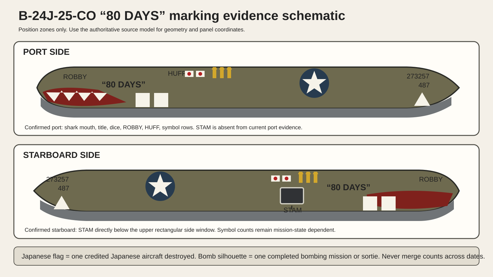

# B-24J-25-CO “80 DAYS” historical livery overview

## 1. Aircraft identity

| Field | Locked value |
|---|---|
| Manufacturer and type | Consolidated B-24J-25-CO Liberator |
| Nickname | “80 DAYS” |
| USAAF serial | `42-73257` |
| Aircraft number | `487` |
| Group | 308th Bomb Group |
| Squadron | 374th Bomb Squadron |
| Air force | Fourteenth Air Force |
| Theater and date | China, 1944 |
| Pipeline ID | `308bg_374bs_42-73257_80-days` |

This package controls historical paint placement and surface treatment. The repository source-model lock continues to control geometry, hierarchy, animation, mechanisms and original UV data.

## 2. Production scope

The current skillpack covers the painted exterior of the fuselage and the fixed vertical-fin skins required for the serial, aircraft number and triangle emblem.

Excluded from this package:

- propellers and hubs
- engines and engine internals
- wheels, tires, brakes and landing gear
- glass
- guns and turret interiors
- cockpit and aircraft interior
- lights, antennas, wires and small mechanical fittings
- wings, nacelles and horizontal-tail livery unless a later task explicitly expands the scope

Existing excluded-part textures remain untouched.

## 3. Evidence classes

- **A, direct and clear:** the exact aircraft is visible, side and placement are readable.
- **B, direct with limitation:** the exact aircraft is visible, but perspective, crop, resolution or obstruction limits measurement.
- **C, contextual:** another 374th Bomb Squadron aircraft or a later reproduction. Useful for material practice only. It cannot prove a marking on “80 DAYS”.
- **Upstream production lock:** an approved reconstruction choice required by the project, with its evidentiary limitation recorded.

## 4. Direct reference set

The external package identifies eight direct-aircraft images:

| ID | View | Principal use | Confidence |
|---|---|---|---|
| E01 | Starboard ground, crew | `STAM`, title, dice, shark mouth, victory flags, bomb marks, upper side window relationship | A |
| E02 | Starboard ground, crew | title, dice, shark mouth proportions and hand-painted edge character | A |
| E03 | Starboard ground, two crew | exact `STAM` relationship to the upper rectangular side window | A |
| E04 | Port nose close-up | `ROBBY`, `HUFF`, title, dice, shark mouth, two symbol rows | A |
| E05 | Port front ground | nose geometry and shark-mouth wrap over curved structure | B |
| E06 | Port in flight | full-aircraft port placement and scale relationships | B |
| E07 | Starboard in flight | full-aircraft starboard placement, national insignia and fin marking relationships | B |
| E08 | Archive nose image | secondary nose-art comparison and archival cross-check | B |

See the exact file inventory, dimensions and hashes in [`references/b24-80-days/README.md`](./references/b24-80-days/README.md).

## 5. Side-specific marking matrix

| Marking | Port side | Starboard side | Production rule |
|---|---|---|---|
| Shark mouth | Confirmed | Confirmed | Trace each side independently. Do not mirror. |
| “80 DAYS” | Confirmed | Confirmed | White, hand-painted, including quotation marks. Match letter tilt and spacing per side. |
| Two dice | Confirmed | Confirmed | Reconstruct perspective and pip arrangement per side. Do not mirror a finished decal. |
| `ROBBY` | Confirmed in E04 | Confirmed in E01/E02 | Place from side-specific photos near the forward nose area. |
| `HUFF` | Clear in E04 | Visibility is limited in the current starboard set | Port placement may be locked from E04. Starboard placement requires a legible selected reference or remains unbaked. |
| `STAM` | No current evidence | Confirmed in E01 and E03 | Starboard-only. Place immediately below the upper rectangular side window. |
| Japanese victory flags | Confirmed as a symbol row | Confirmed as a symbol row | Colored flags. One flag represents one credited Japanese aircraft destroyed. Count and arrangement depend on selected mission state. |
| Bomb mission marks | Confirmed as bomb silhouettes | Confirmed as bomb silhouettes | One bomb represents one completed bombing mission or sortie in this marking system. Count and arrangement depend on selected mission state. |
| National insignia | Confirmed in full-aircraft views | Confirmed in full-aircraft views | Use source-model panel location. Do not infer from a generic B-24 profile. |
| Fin serial and number | Confirmed in full-aircraft views | Confirmed in full-aircraft views | `273257` over `487`, with white triangle. Validate both fixed fins separately. |



## 6. Mission-state policy

Victory flags and bomb marks were added as operational history accumulated. The direct photographs therefore can represent different dates.

Every production version must declare:

```yaml
mission_state_id: 80days-<reference-id-or-date>-v<revision>
primary_photo: E0X
supporting_photos: [E0Y, E0Z]
victory_flag_count: <counted from primary state>
bomb_mark_count: <counted from primary state>
count_status: verified | provisional | obscured
```

Rules:

1. Count symbols from one selected state.
2. Use another image only to resolve shape or placement when it does not contradict the selected state.
3. Do not add the maximum visible count from each photograph.
4. Record obscured symbols as unknown rather than guessing.
5. Keep a screenshot or annotated count sheet with the texture release.

## 7. Color and finish status

| Element | Production direction | Evidence status |
|---|---|---|
| Upper finish | Wartime olive drab, faded and locally repaired | Required; exact color value remains subject to factory-block and color-reference review |
| Lower finish | Neutral gray family, aged and stained | Required; exact color value remains subject to review |
| Title and dice | Aged white paint with dark pips | Directly supported in monochrome tonal evidence; exact white aging is reconstructed |
| Shark-mouth teeth | White with dark edging | Directly supported in tonal evidence |
| Shark-mouth interior | Deep red | Upstream-approved reconstruction color; current direct photographs are monochrome |
| Japanese flags | White field with colored red disc or historically correct flag motif, based on selected reference interpretation | Symbol meaning is locked; exact paint color requires color-standard review |
| Bomb mission marks | Yellow or yellow-ochre reconstruction | Upstream production direction; exact hue requires color-reference review |

Color reconstruction must remain editable through masks. It must not be flattened irreversibly into one untraceable image.

## 8. Surface character

The target is a heavily used operational aircraft, with repeated mission wear. It must retain aircraft-level plausibility.

Required layers:

- broad ultraviolet fading and uneven olive-drab chalking
- panel-to-panel tone variation and field touch-up patches
- grime accumulation along lap joints, access doors and fastener rows
- directional oil and exhaust streaks where supported by the aircraft layout
- chipped and abraded hand-painted nose art
- maintenance wear around handles, steps, service openings and frequently removed panels
- individually readable rivet rows and panel seams under close inspection
- restrained oil-canning and sheet-metal undulation through normal or displacement, without changing silhouette or mechanical clearance

Avoid wreck-level corrosion, random bullet holes, fantasy battle damage, uniform black rivet dots, and procedural noise that ignores panel construction.

## 9. Confirmed, provisional and open items

### Confirmed

- aircraft identity and unit
- title, quotation marks and two dice on both photographed sides
- shark mouth on both photographed sides
- `ROBBY` forward marking
- `STAM` on starboard below the upper rectangular side window
- tail `273257`, `487` and white triangle
- Japanese victory flags and bomb symbols have different meanings
- marking counts vary with operational time

### Provisional

- exact olive-drab and neutral-gray color coordinates
- exact deep-red mouth value
- exact yellow of bomb symbols
- starboard `HUFF` placement where resolution is insufficient
- a single final symbol count until the upstream reviewer selects a mission state

### Open

- dated original prints or captions that correlate every photograph to a specific mission count
- verified original color photography of this exact aircraft
- original artwork masks or maintenance records
- authoritative-model variant compatibility audit for the B-24J-25-CO configuration

## 10. Release condition

A texture release may advance to review only after:

- one mission state is selected and counted
- port and starboard placement sheets are approved
- the authoritative model passes variant and `LiveryUV` audits
- all PBR maps pass the specification
- close-up renders prove rivet and panel detail without exaggeration
- upstream historical review approves the visual result
