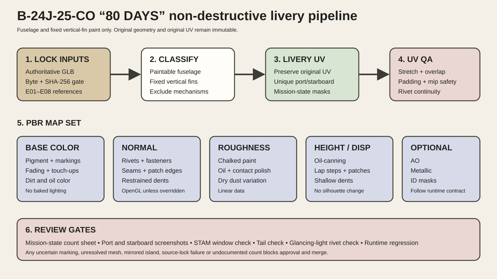

# B-24J-25-CO “80 DAYS” texture specification

## 1. Purpose

Define a non-destructive, museum-reviewable PBR texture package for the “80 DAYS” fuselage and fixed vertical-fin exterior paint. This document does not authorize geometry edits or substitute assets.

## 2. Source and UV contract

- Preserve the source GLB, node hierarchy, animation, original materials and original UV set.
- Add a second UV channel named `LiveryUV` only after the source-model gate and mesh classification pass.
- For this skillpack, `LiveryUV` includes only approved fuselage exterior metal skin, glazed-nose surrounding metal skin, exterior access panels attached to the fuselage, and both fixed vertical-fin painted skins.
- Exclude propellers, hubs, engines, engine internals, wheels, tires, brakes, landing gear, glass, guns, turret interiors, cockpit, interior, lights, antennas, wires and small mechanisms.
- Wings, nacelles and horizontal-tail livery remain outside this package unless a later task expands scope.

## 3. Resolution and texel density

Minimum review target:

- 4K maps for pipeline function and distant review
- 8K maps recommended for museum close-up work
- optional UDIM or multiple 8K tiles when the authoritative model and renderer support them

Priority order:

1. nose art, title, dice and crew-name zones
2. starboard `STAM` window zone
3. mission and victory mark zones
4. fin serial and triangle zones
5. hatches, maintenance panels, lap joints and high-wear access areas
6. broad fuselage skin

The chosen layout must let individual rivet rows remain separable at intended close-up distance. If one 8K atlas cannot maintain this criterion, use a documented multi-tile strategy rather than painting oversized rivets.

## 4. Required maps

### 4.1 Base Color or Albedo

Contains:

- olive-drab and neutral-gray paint color
- hand-painted markings and masks
- pigment fading, chalking and panel-to-panel color variation
- dirt color, oil color and paint touch-up color
- exposed-metal color where paint is genuinely lost

Must not contain:

- baked directional lighting
- hard ambient-occlusion shadows
- exaggerated black rivet dots
- normal-map relief painted as fake highlights
- mirrored lettering or side-inappropriate markings

Color space: sRGB.

### 4.2 Normal

Contains high-frequency and medium-frequency surface relief:

- rivet heads and selected flush-fastener recesses
- lap joints and panel seams
- inspection-plate edges
- patch plates and local raised sheet edges
- shallow dents and restrained oil-canning
- paint-layer breakup where it produces measurable surface relief

Rules:

- derive rivet paths from source geometry, panel construction and reference photographs
- preserve direction and spacing through UV seams
- avoid uniform procedural rivet grids
- keep relief physically restrained at glancing angles
- do not deform glass fits, gun mounts, turret rings, door clearances or control-surface gaps

Preferred convention: OpenGL tangent-space normal unless the runtime contract specifies DirectX. Record the convention in the manifest.

### 4.3 Roughness

Contains reflectance variation:

- chalked and sun-faded paint, generally rougher
- recently touched-up paint, locally different from surrounding finish
- polished maintenance contact areas, locally smoother
- wet or oily grime, smoother and darker in reflection response
- dry dust and oxidized paint, rougher
- painted title, dice and nose art with aged but distinct binder response

Roughness must follow material history, panel access and airflow. It must not be random monochrome noise.

Color space: linear.

### 4.4 Height or Displacement

Contains low-frequency and selected medium-frequency geometric relief:

- restrained sheet-metal oil-canning
- lapped panel steps
- raised repair patches
- shallow dents supported by references
- selected access-panel relief

Rules:

- displacement must not change the aircraft silhouette at normal viewing distance
- do not displace transparent or mechanical surfaces
- use signed or midpoint-neutral convention documented in the manifest
- clamp intensity against model scale and test with glancing light
- micro rivet relief may remain in Normal when displacement tessellation is unavailable

Color space: linear.

### 4.5 Ambient Occlusion

AO is optional and must follow the existing renderer contract.

- Use only local cavity occlusion derived from approved surface structure.
- Do not duplicate broad lighting or paint permanent shadows beneath wings and turrets.
- Avoid dark halos around every rivet.

Color space: linear.

### 4.6 Metallic or metalness mask

Use only when the renderer supports it.

- painted olive-drab, gray and marking paint: non-metallic
- exposed aluminum or bare metal from real paint loss: metallic
- grime and oil do not convert painted areas into metal

Color space: linear.

### 4.7 ID and decal masks

Keep editable masks for:

- port shark mouth
- starboard shark mouth
- port title and dice
- starboard title and dice
- `ROBBY`
- port `HUFF`
- provisional starboard `HUFF`
- starboard `STAM`
- victory flags
- bomb mission marks
- national insignia
- port fin serial and triangle
- starboard fin serial and triangle
- olive-drab base, neutral-gray base, touch-ups, exposed metal, oil, dust and grime

## 5. Historical marking treatment

### Title

- exact text: `“80 DAYS”`
- aged white hand-painted appearance
- preserve side-specific tilt, spacing, brush edge and paint loss
- no clean computer-font replacement in final maps

### Dice

- two white dice below the title
- trace each side from its own photograph
- preserve perspective distortion, face division and pip layout
- keep brush irregularity and wear

### Shark mouth

- deep-red interior as the upstream-approved reconstruction color
- white teeth
- dark outline and shadow edging where photographically supported
- side-specific tooth count, tooth spacing and wrap
- chipped leading edges, panel-line interruptions and worn paint
- no plain black interior

### Crew names

- `ROBBY`: forward nose area, side-specific placement from direct photos
- `HUFF`: near cockpit, port confirmed, starboard conditional on legibility
- `STAM`: starboard-only, directly below the upper rectangular side window

### Victory and mission symbols

- Japanese victory flag: one colored flag per credited Japanese aircraft destroyed
- bomb mark: one bomb per completed bombing mission or sortie in the aircraft's marking convention
- counts and arrangement must be tied to one declared `mission_state_id`
- never combine later and earlier counts

### Tail

- `273257` above `487`
- white triangle beneath
- validate both fixed fins independently
- follow panel breaks, rivet lines and side-specific distortion

## 6. Wear construction hierarchy

### Macro scale

- sun fading along upper curvature
- broad airflow and dust patterns
- neutral-gray underside staining
- panel-repair color blocks
- directional exhaust and oil influence

### Meso scale

- panel edge abrasion
- maintenance-zone wear
- hatch and fastener grime
- touch-up spray or brush transitions
- nose-art chipping at seams and high-exposure edges

### Micro scale

- individual rivet response
- fine scratches
- small paint chips
- pigment grain and chalking
- subtle stain breakup

Each scale must be editable and independently reviewable. Do not use one noisy layer to imitate all scales.

## 7. Rivet and skin-detail acceptance

A close-up review render must show:

- continuous, correctly routed rivet rows
- variation between raised and flush fasteners where the source supports it
- panel seams that remain aligned across UV boundaries
- no doubled rivets at mirrored or overlapping islands
- no rivet texture on glass, guns, tires or excluded mechanisms
- no high-contrast black dot treatment in Base Color
- relief that remains believable under glancing light
- fine grime collected around selected fasteners without equal treatment on every rivet

## 8. Wear target

The aircraft should read as a frequently flown China-theater combat aircraft with many completed missions:

- strong operational fading
- visible maintenance and field repair history
- dusty, grimy and oil-marked service surfaces
- chipped hand-painted markings
- clear rivets and skin construction

The result must remain airworthy and maintained. Avoid abandoned-wreck corrosion, deep structural perforation, fantasy bullet damage and uniform rust.

## 9. Suggested file naming

```text
b24_80days_<mission-state>_fuselage_basecolor_8k.png
b24_80days_<mission-state>_fuselage_normal_opengl_8k.png
b24_80days_<mission-state>_fuselage_roughness_8k.png
b24_80days_<mission-state>_fuselage_height_8k.exr
b24_80days_<mission-state>_fuselage_ao_8k.png
b24_80days_<mission-state>_fuselage_metallic_8k.png
b24_80days_<mission-state>_fuselage_masks_8k.exr
b24_80days_<mission-state>_manifest.json
```

## 10. Review renders

Required screenshots:

- port full side
- starboard full side
- port nose close-up
- starboard nose and `STAM` close-up
- both fixed fins
- top-fuselage symbol rows
- underside neutral-gray transition
- rivet and panel glancing-light close-up
- Base Color inspection
- Normal inspection
- Roughness inspection
- Height or Displacement inspection
- UV checker and seam inspection

## 11. Pipeline diagram


